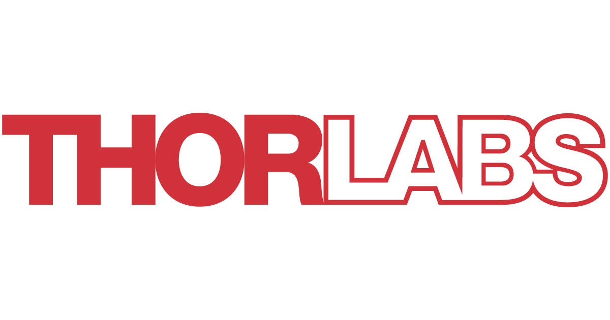
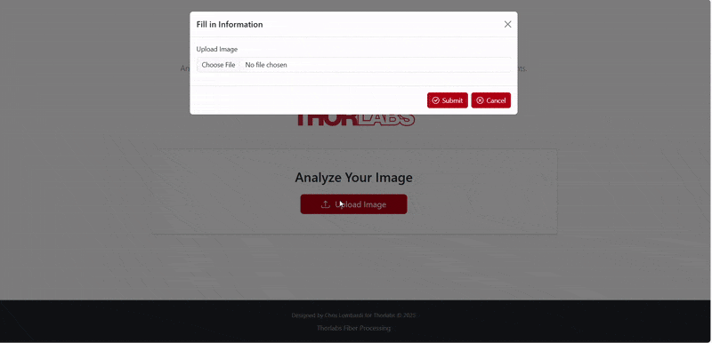
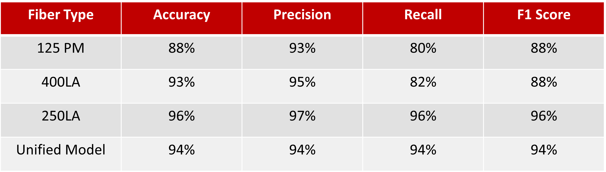
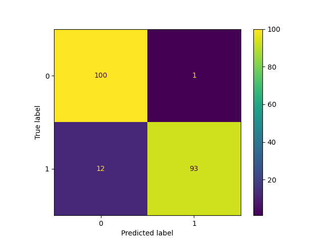
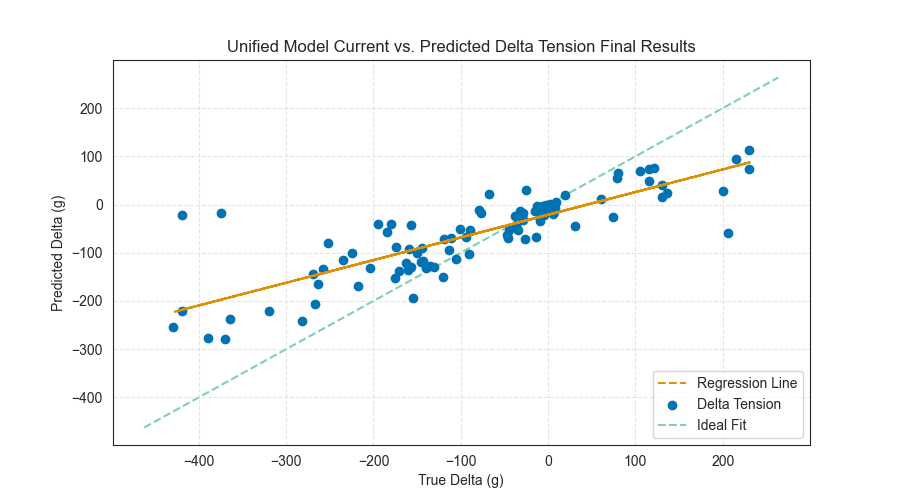
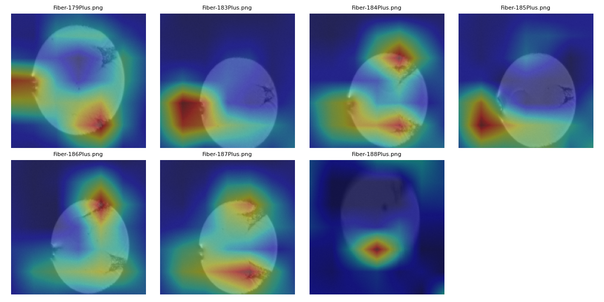

# Fiber Cleave Processing

<p align="center">
  
</p>

[](https://imageprocessingclone.readthedocs.io/en/latest/)


[](https://www.python.org/downloads/)
[](https://tensorflow.org/)
[](https://opensource.org/licenses/MIT)

A machine learning package for fiber cleave quality classification and tension prediction using CNN and MLP/XGboost models.

##  Documentation

For a full guide, API reference, and detailed tutorials, please see the official documentation hosted on Read the Docs:

**[https://imageprocessingclone.readthedocs.io/](https://imageprocessingclone.readthedocs.io/en/latest/)**

##  Table of Contents

- [Project Description](#project-description)
- [Key Features](#key-features)
- [Installation](#installation)
- [Quick Start](#quick-start)
- [Configuration](#configuration)
- [Usage Examples](#usage-examples)
- [Tips for Better Accuracy](#tips-for-better-accuracy)
- [Tech Stack](#tech-stack)
- [Contributing](#contributing)
- [License](#license)

## Project Description

This project implements a comprehensive machine learning pipeline for analyzing fiber cleave quality using images from the THORLABS Fiber Cleave Analyzer (FCA). The system consists of three main components:

1. **CNN Classification Model**: Classifies cleave images as good or bad based on visual features alone or inclusiong of numerical features
2. **MLP Regression Model**: Predicts optimal tension parameters for producing good cleaves
3. **XGBoost Regression Model**: Predicts the change in tension needed to produce a good cleave 

The models use transfer learning with either MobileNetV2, ResNet, or EfficientNetB0 as the backbone and are optimized using Keras Tuner for hyperparameter optimization.


<a href="https://github.com/c-lombardi23/ImageProcessingClone">
  
</a>


## Key Features

- **Transfer Learning**: Uses pre-trained models for robust feature extraction
- **Multi-Modal Input**: Combines image features with numerical parameters
- **Hyperparameter Optimization**: Automated tuning using Keras Tuner
- **Flexible Architecture**: Supports both classification and regression tasks
- **K-Fold Cross Validation**: Robust model evaluation
- **GradCAM Visualization**: Model interpretability through heatmaps
- **Command Line Interface**: Easy-to-use CLI for training and inference
- **Comprehensive Logging**: Training history and model checkpoints
- **MFlow Support**: Allows user to track training and testing runs easily

## 📊 Results & Performance

The models were evaluated on a hold-out test set (typical 80/20 split). The multi-modal CNN demonstrates high performance in distinguishing between "good" and "bad" cleaves, while the XGBoost regression model provides accurate information on the direction to change tension value.

### Classification (Multi-Modal CNN)
<p align="center">

</p>
Comparison of metrics for individual models vs. final unified model

<p align="center">

</p>
Confusion matrix for Unified CNN results

### Regression (XGBoost Tension Prediction)

<p align="center">

</p>
True change in tension vs. predcited change in tension for XGBoost model

### Grad-CAM

To ensure the CNN is learning relevant physical features, Grad-CAM visualizations were generated. The heatmaps confirm that the model is correctly focusing on the desired features.

<p align="center">

</p>


## Installation

### Prerequisites

- Python 3.10 or higher
- TensorFlow 2.19 or higher
- CUDA-compatible GPU (recommended for training)

### Install from Source

```bash
# Clone the repository
git clone https://github.com/c-lombardi23/ImageProcessingClone.git
cd ImageProcessing


# Create Virtual Enviornment
python -m venv myenv

# Activate Virtual Enviornment

# On Windows
myenv\Scripts\activate

# On Linux:
source myenv/bin/activate

# Install in development mode
pip install -e .

# Or install with development dependencies
pip install -e ".[dev]"
```

### Verify Installation

```bash
cleave-app --help

```
### Build Documentation

```bash
sphinx-build docs/source docs/build
```

### Display Documentation

```bash
cd docs/build
python -m http.server 8000
```
navigate to local host in browser with specified port number

### Displaying MLFlow Runs

```bash
mlflow ui
```

navigate to local host in browser with specified port number


## Quick Start

1. **Prepare your data**:
   - Organize cleave images in a folder
   - Create a CSV file with metadata (tension, angle, scribe diameter, misting, hackle, tearing)

2. **Create a configuration file** (see [Configuration](#configuration) section)

3. **Train a classification model**:
   ```bash
   cleave-app --file_path config.json
   ```

## Configuration

The application uses a JSON configuration file to specify all parameters. **Each mode uses a dedicated config class with its own required and optional fields.** The CLI automatically loads the correct config class for the selected mode. There are skeleton configuration files provided for most of the different modes in the config_files/ folder.

> **Note:** Not all parameters are required for every mode. Refer to the mode-specific config class or config.schema.json file for required/optional fields. The system will validate your config and provide clear errors if required fields are missing.

### Example: `train_cnn` Configuration

```json
{
  "mode": "train_cnn",
  "cnn_mode": "bad_good",
  "classification_type": "binary",
  "backbone": "efficientnet",

  "csv_path": "data/cleaves_dataset.csv",
  "img_folder": "data/cleave_images/",
  "image_shape": [224, 224, 3],
  "feature_shape": [6],

  "learning_rate": 0.001,
  "batch_size": 16,
  "max_epochs": 50,
  "test_size": 0.2,

  "save_model_file": "models/cnn_classifier_v1.keras",
  "save_history_file": "reports/cnn_classifier_v1_history.csv",

  "checkpoints": "y",
  "checkpoint_filepath": "models/checkpoints/cnn_v1_checkpoint.keras",
  "monitor": "val_accuracy",
  "method": "max"
}
```

### Configuration Parameters

- **`mode`**: Operation mode (see table below)
- **Other fields**: See the mode-specific config class in `src/cleave_app/config_schema.py` for required/optional fields for each mode.
- **Validation**: The CLI will validate your config and provide clear errors if required fields are missing or invalid for the selected mode.

### Available Modes

| Mode | Description |
|------|-------------|
| `train_cnn` | Train CNN classification model |
| `train_mlp` | Train MLP regression model |
| `train_image_only` | Train image-only classification model |
| `train_xgboost` | Train XGBoost regressor |
| `cnn_hyperparameter` | Run hyperparameter search for CNN |
| `mlp_hyperparameter` | Run hyperparameter search for MLP |
| `image_hyperparameter` | Run hyperparameter search for image-only model |
| `test_cnn` | Test CNN model performance |
| `test_mlp` | Test MLP model performance |
| `test_image_only` | Test the CNN on only image data |
| `test_xgboost`  | Test the XGBoost regressor  |
| `train_kfold_cnn` | Train CNN with k-fold cross validation |
| `train_kfold_mlp` | Train MLP with k-fold cross validation |
| `grad_cam` | Generate GradCAM visualizations |
| `train_rl` | Train an agent to predict optinal tension |
| `test_rl`  | Test the RL agent on predicting tension |

> **Extensibility:** To add a new mode, simply add a new config class in `config_schema.py` and update the mode-to-config mapping.

## Usage Examples

### Training a Classification Model

```bash
# Train CNN model
cleave-app --file_path config_cnn.json

# Train with hyperparameter optimization
cleave-app --file_path config_cnn_tuner.json
```

### Training a Regression Model

```bash
# Train MLP model for tension prediction
cleave-app --file_path config_mlp.json
```

### Testing Models

```bash
# Test classification model
cleave-app --file_path config_test_cnn.json

# Test regression model
cleave-app --file_path config_test_mlp.json
```

### K-Fold Cross Validation

```bash
# Train with k-fold cross validation
cleave-app --file_path config_kfold.json
```

## Tips for Better Accuracy

If your image-only model is not achieving the desired accuracy, consider the following strategies:

- **Fine-tune the Pretrained Backbone:** Unfreeze the last 10–20 layers of the pre-trained and continue training with a low learning rate.
- **Increase Model Capacity:** Add more dense layers or increase the number of units after the global average pooling layer.
- **Tune Data Augmentation:** Use more aggressive or varied augmentations (e.g., `RandomFlip`, higher `RandomBrightness`/`RandomContrast`).
- **Regularization:** Add or increase dropout, or use L2 regularization on dense layers.
- **Learning Rate Scheduling:** Use a learning rate scheduler or `ReduceLROnPlateau` callback.
- **Handle Class Imbalance:** Use class weights or oversample minority classes if your dataset is imbalanced.
- **Hyperparameter Tuning:** Use Keras Tuner to search for the best architecture and training parameters.
- **Image Preprocessing:** Ensure images are normalized to the range expected by the backbone (done in code already).
- **Train Longer with Early Stopping:** Allow more epochs and use early stopping to avoid underfitting.

### Example: Improved  Model Architecture

```python
def _build_pretrained_model(
        self,
        image_shape: Tuple[int, int, int],
        param_shape: Tuple[int, ...],
        dropout1: float,
        dense1: int,
        dropout2: float,
        dense2: int,
        dropout3: float,
        brightness: float,
        contrast: float,
        height: float,
        width: float,
        rotation: float,
        backbone: Optional[str] = "mobilenet",
        unfreeze_from: Optional[int] = None,
    ) -> "tf.keras.Model":
        """Build a model using pre-trained EfficientNetB0 to supplement small
        dataset.

        Args:
            image_shape: Dimensions of input images (height, width, channels)
            param_shape: Dimensions of numerical parameters
            unfreeze_from: Layer index from which to unfreeze weights (None = all frozen)
            dropout1: Perentage of inputs to zero out
            dense1: Number of neurons in first fully connected layer
            dropout2: Percentage of inputs to zero out
            dense2: Number of neurons in second fully connected layer
            dropout3: Percentage of final inputs to zero out

        Returns:
            tf.keras.Model: Compiled model ready for training
        """
        pre_trained_model = self._get_backbone_model(
            backbone=backbone, image_shape=image_shape
        )
        pre_trained_model.trainable = unfreeze_from is not None

        if unfreeze_from is not None:
            for layer in pre_trained_model.layers[:unfreeze_from]:
                layer.trainable = False

        # Data augmentation pipeline
        data_augmentation = self.get_data_augmentation(
            rotation=rotation,
            brightness=brightness,
            height=height,
            width=width,
            contrast=contrast,
        )

        # CNN for images
        image_input = Input(shape=image_shape)
        x = data_augmentation(image_input)
        x = pre_trained_model(x)
        x = GlobalAveragePooling2D(name="global_avg")(x)
        x = Dropout(dropout1, name="dropout_1")(x)

        # Numerical features section
        params_input = Input(shape=param_shape)
        y = Dense(dense1, name="dense_1", activation="relu")(params_input)
        y = Dropout(dropout2, name="dropout_2")(
            y
        )  # Added to remove reliance on features
        y = BatchNormalization()(y)

        combined = Concatenate()([x, y])
        z = Dense(dense2, name="dense_2", activation="relu")(combined)
        z = BatchNormalization(name="batch_norm")(z)
        z = Dropout(dropout3, name="dropout_3")(z)
        if self.classification_type == "binary":
            activation = "sigmoid"
        elif self.classification_type == "multiclass":
            activation = "softmax"
        z = Dense(
            self.num_classes,
            name="output_layer",
            activation=activation,
        )(z)

        model = Model(inputs=[image_input, params_input], outputs=z)
        model.summary()
        return model
```

For more details, see the [Configuration](#configuration) and [Usage Examples](#usage-examples) sections above.

## Tech Stack

- **Deep Learning**: TensorFlow 2.19+, Keras
- **Hyperparameter Tuning**: Keras Tuner
- **Data Processing**: NumPy, Pandas, scikit-learn
- **Image Processing**: OpenCV, Pillow
- **Visualization**: Matplotlib
- **Configuration**: Pydantic (mode-specific config classes)
- **CLI**: Typer, Click
- **Testing**: pytest
- **DevTools**: Pydantic, Black, Pylint, Flake8

## Project Structure

```
FiberCleaveProcessing/
├── .github/                 # GitHub Actions and workflow configurations
├── config_files/            # Example JSON configuration files for different modes
├── docs/                    # Sphinx documentation source and build files
│   ├── build/
│   └── source/
├── mlruns/                  # Default output directory for MLflow experiment tracking
├── notebooks/               # Jupyter notebooks for exploration and analysis
├── src/
│   └── cleave_app/          # Main application source code package
│       ├── __init__.py
│       ├── commands/            # Houses the commands for each mode
│       ├── config_schema.py     # Pydantic models for configuration validation
│       ├── data_processing.py   # Data loading, cleaning, and dataset creation
│       ├── main.py              # Main CLI entry point
│       ├── mlflow_utils.py      # Utility functions for MLflow logging
│       ├── model_pipeline.py    # Core CNN model building and training pipeline
│       ├── mlp_model.py         # Logic specific to the MLP model
│       ├── xgboost_pipeline.py  # Logic specific to the XGBoost model
│       ├── rl_pipeline.py       # Logic for the Reinforcement Learning agent
│       ├── hyperparameter_tuning.py # Keras Tuner setup and logic
│       ├── prediction_testing.py  # Scripts for model evaluation and testing
│       └── grad_cam.py          # Grad-CAM implementation for model explainability
├── tests/                   # Pytest unit and integration tests
│   ├── test_train_cnn.py
│   ├── test_train_mlp.py
│   ├── test_train_xgb.py
│   ├── test_test_cnn.py
│   ├── test_test_mlp.py
│   └── test_test_xgb.py
├── .gitignore               # Specifies files and directories to be ignored by Git
├── requirements.txt         # Project dependencies for pip
├── Makefile                 # Makefile for common development tasks
├── make.bat                 # Windows batch script equivalent
├── build_docs.sh            # Shell script to build Sphinx documentation
└── cleave_example_app.gif   # Demo GIF for project overview
```

## Contributing

We welcome contributions! Please feel free to submit a Pull Request. For major changes, please open an issue first to discuss what you would like to change.

### Development Setup

1. Fork the repository
2. Create a feature branch: `git checkout -b feature/new_feature`
3. Install in development mode: `pip install -e ".[dev]"`
4. Make your changes and add tests
5. Run tests: `pytest`
6. Commit your changes: `git commit -m 'Add new feature'`
7. Push to the branch: `git push origin feature/new_feature`
8. Open a Pull Request

## License

This project is licensed under the MIT License - see the [LICENSE](LICENSE) file for details.

## Acknowledgments

- THORLABS for the Fiber Cleave Analyzer (FCA)
- TensorFlow and Keras 
- The open-source community for various tools and libraries

## Support

If you encounter any issues or have questions:

1. Check the [Issues](https://github.com/c-lombardi23/ImageProcessingClone/issues) page
2. Create a new issue with detailed information
3. Contact: clombardi23245@gmail.com

---

**Note**: This project is designed for research and development purposes. Please ensure you have proper data handling and validation procedures in place for production use.
